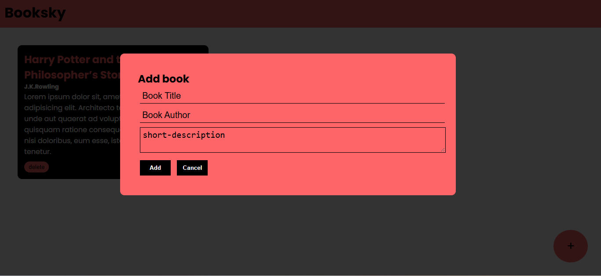

# 📚 Booksky – Book Management App

Booksky is a simple and interactive **Book Management Web Application** built using **HTML, CSS, and JavaScript**.

The application allows users to add books with a title, author, and description, and dynamically remove books when they are no longer needed.

## 🌐 Live Website

🔗 [View Live Website](https://inthusha20241647-commits.github.io/booksky-book-management/)

## 📸 Screenshot

### 🖥️ Desktop View

<div align="center">
  
</div>

## ✨ Features

* 📖 Display books with title, author, and description
* ➕ Add new books using a popup form
* 🗑️ Delete books dynamically
* 💬 Interactive popup for adding books
* ❌ Cancel the popup without adding a book
* 📱 Responsive-friendly layout
* 🎨 Clean and simple user interface

## 🛠️ Technologies Used

* **HTML5** – Application structure
* **CSS3** – Styling and responsive layout
* **JavaScript** – DOM manipulation and interactive functionality
* **Google Fonts** – Poppins typography

## 📂 Project Structure

```text
Booksky/
├── index.html
├── style.css
├── script.js
├── images/
│   └── desktop.png
└── README.md
```

## 🚀 How to Run

1. Clone the repository.
2. Open the project in VS Code.
3. Open `index.html` using **Live Server** or directly in a web browser.

No additional installation is required.

## 📖 How It Works

### Add a Book

1. Click the **+** button.
2. Enter the book title.
3. Enter the author's name.
4. Add a short description.
5. Click **Add**.
6. The book will appear on the page.

### Delete a Book

Click the **Delete** button on any book card to remove it from the page.

## 🎯 Project Purpose

This project was created to practice **HTML, CSS, JavaScript, and DOM manipulation** by building an interactive web application.
